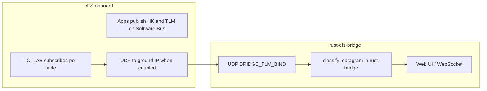

# Available telemetry in this cFS / bridge project

This document inventories **telemetry that the cFS mission configuration defines** and what actually reaches the **rust-cfs-bridge** ground stack. It is derived from the **`cfs/`** submodule in this repository (NASA cFS “Draco”–style layout).

## How telemetry flows (three different layers)

1. **Software Bus (SB)** — Applications publish messages identified by **`CFE_SB_MsgId_t`** (often referred to by macro names like `CFE_ES_HK_TLM_MID`). Anything built into the image *can* publish HK/TLM if its scheduler or commands request it.
2. **TO_LAB → UDP** — **TO_LAB** copies subscribed SB messages into **CCSDS-style frames** and sends them to a **UDP destination** after **`EnableOutput`** (see [TELEMETRY.md](TELEMETRY.md)). Only **MsgIds listed in the subscription table** are forwarded.
3. **rust-bridge** — Listens on **`BRIDGE_TLM_BIND`**, parses **some** layouts into JSON (`TlmEvent`). Packets that are not yet understood become **`parse_error`** (with `hex_preview`), not silent drops.

**Important:** “Defined in the mission topic ID table” is **not** the same as “enabled in TO_LAB” or “parsed in Rust.”

---

## Default CPU1 apps in *this* repository

The sample mission selects applications in [`cfs/cfe/cmake/sample_defs/targets.cmake`](../cfs/cfe/cmake/sample_defs/targets.cmake):

| Scope | Applications |
|-------|----------------|
| **Global dynamic apps** | `sample_app`, `sample_lib` |
| **cpu1 `APPLIST`** | `ci_lab`, `bridge_reader`, `to_lab`, `sch_lab` |

So the **lab image** used by Docker includes **CI_LAB**, **TO_LAB**, **SCH_LAB**, **SAMPLE_APP**, plus **bridge_reader** (verification subscriber). It does **not** include optional cFS apps such as **FM**, **LC**, **DS**, **HK**, **HS**, **SC**, or **CF** unless you change `targets.cmake` and add those apps to the build.

**bridge_reader** subscribes to the bridge telecommand MsgIds for logging; it does **not** define a separate telemetry product for the ground.

---

## Mission telemetry topic IDs (canonical list)

The authoritative **topic ID → telemetry kind** map for the bundled mission is in:

[`cfs/cfe/cmake/sample_defs/eds/cfe-topicids.xml`](../cfs/cfe/cmake/sample_defs/eds/cfe-topicids.xml)

Telemetry topics are defined as `CFE_MISSION_<NAME>_TLM_TOPICID` (or `*_EVENT_MSG_*`, `*_STATS_*`, etc.). They are converted to runtime **MsgIds** via `CFE_PLATFORM_TLM_TOPICID_TO_MIDV(...)` in generated/platform headers (see `default_cfe_*_msgids.h` under each app/module).

### cFE core (Executive, Event, SB, Table, Time)

| Topic (EDS / mission) | Typical purpose |
|------------------------|-----------------|
| `ES_HK_TLM` | Executive Services housekeeping (heap, apps, resets, …) |
| `ES_APP_TLM` | ES application info telemetry |
| `ES_MEMSTATS_TLM` | ES memory statistics |
| `ES_SHELL_TLM` | ES shell telemetry (if enabled in mission config) |
| `EVS_HK_TLM` | Event Services HK |
| `EVS_SHORT_EVENT_MSG` / `EVS_LONG_EVENT_MSG` | EVS event messages |
| `SB_HK_TLM` | Software Bus HK |
| `SB_STATS_TLM` | SB pipe statistics |
| `SB_ALLSUBS_TLM` / `SB_ONESUB_TLM` | SB subscription dumps |
| `TBL_HK_TLM` | Table Services HK |
| `TBL_REG_TLM` | Table registry telemetry |
| `TIME_HK_TLM` | TIME HK |
| `TIME_DIAG_TLM` | TIME diagnostics |

### Lab / sample apps (this repo’s cpu1 list)

| Topic | Application | Typical purpose |
|-------|-------------|-----------------|
| `TO_LAB_HK_TLM` | TO_LAB | TO_LAB housekeeping |
| `TO_LAB_DATA_TYPES` | TO_LAB | Lab “data types” test telemetry |
| `CI_LAB_HK_TLM` | CI_LAB | CI_LAB housekeeping |
| `SAMPLE_APP_HK_TLM` | SAMPLE_APP | Sample app HK |

### cFS bundle apps (defined in topic IDs; **not** in default cpu1 `APPLIST`)

These appear in **`cfe-topicids.xml`** so a mission can build them; they are **not** part of the default `cpu1_APPLIST` in `targets.cmake` unless you add them:

| Subsystem | Topics (examples) |
|-----------|-------------------|
| **FM** (File Manager) | `FM_HK_TLM`, `FM_FILE_INFO_TLM`, `FM_DIR_LIST_TLM`, `FM_OPEN_FILES_TLM`, `FM_MONITOR_TLM` |
| **LC** (Limit Checker) | `LC_HK_TLM`, `LC_RTS_REQ` |
| **DS** (Data Storage) | `DS_HK_TLM`, `DS_DIAG_TLM`, `DS_COMP_TLM` |
| **HK** (Housekeeping app) | `HK_HK_TLM`, `HK_COMBINED_PKT1` … `HK_COMBINED_PKT4` |
| **HS** (Health and Safety) | `HS_HK_TLM`, `HS_DIAG_TLM`, `HS_COMP_TLM` |
| **SC** (Stored Commands) | `SC_HK_TLM` |
| **CF** (CFDP) | `CF_HK_TLM`, `CF_EOT_TLM` |
| **TO** (full TO, not TO_LAB) | `TO_HK_TLM`, `TO_DATA_TYPES` |
| **CI** (check-in / interface) | `CI_HK_TLM` |

### Test

| Topic | Purpose |
|-------|---------|
| `TEST_HK_TLM` | cFE testcase HK |

---

## TO_LAB subscription table (what actually reaches UDP)

Onboard, TO_LAB forwards **only** streams that are subscribed in **`to_lab_sub.tbl`**, sourced from:

[`cfs/apps/to_lab/fsw/tables/to_lab_sub.c`](../cfs/apps/to_lab/fsw/tables/to_lab_sub.c)

In **this repository**, [`to_lab_sub.c`](../cfs/apps/to_lab/fsw/tables/to_lab_sub.c) enables **`CFE_ES_HK_TLM_MID`** (Executive Services HK) and **`TO_LAB_HK_TLM_MID`** so those streams can be forwarded once **`EnableOutput`** and HK scheduling are active. To add more MsgIds (EVS, CI_LAB HK, …), extend the table and reload per cFS procedures. The sentinel `CFE_SB_MSGID_RESERVED` still marks the end of the list.

After enabling:

1. Commands must **`EnableOutput`** with the ground IP.
2. **HK requests** (e.g. `SEND_HK` for each app) drive periodic HK packets on the SB.
3. TO_LAB wraps subscribed messages and sends UDP to the lab address.

---

## rust-cfs-bridge (`rust-bridge/`) — what is parsed today

The ground server does **not** automatically know every cFS product. Current behavior:

| On-wire | JSON `kind` (`TlmEvent`) | Notes |
|---------|---------------------------|--------|
| CCSDS primary + **CFE ES HK** payload (LE 168-byte body after header) | `es_hk_v1` | Matches `rust-bridge/src/tlm/es_hk.rs` and `classify_datagram` in [`rust-bridge/src/tlm/mod.rs`](../rust-bridge/src/tlm/mod.rs). |
| Anything else | `parse_error` | Includes `hex_preview` and optional primary header summary. |

So **EVS event messages**, **SB stats**, **TO_LAB HK** (different layout), **CI_LAB HK**, etc., require **additional parsers** and new `TlmEvent` variants (or a generic `raw_tlm` arm) to show structured fields in the UI.

---

## Related documentation

| Document | Content |
|----------|---------|
| [TELEMETRY.md](TELEMETRY.md) | UDP bind, WebSocket URL, mock script, troubleshooting |
| [MESSAGE_FLOW.md](MESSAGE_FLOW.md) | Uplink telecommand path (CI_LAB) |
| [docs/NEXT_STEPS.md](NEXT_STEPS.md) | Planned ground UI, filters/pagination, and alignment with this inventory |

---

## Maintenance

When you **add apps** to `targets.cmake` or **change** `cfe-topicids.xml` / MsgId macros, update this file’s tables so the **mission inventory** stays aligned. When you **add Rust parsers**, update the **rust-cfs-bridge** section above.
