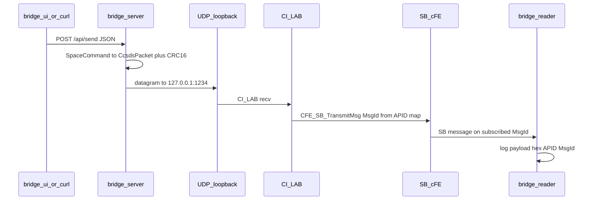

# Message flow

This document traces a **single telecommand** from the operator through the **HTTP API**, **UDP**, **CI_LAB**, and **bridge_reader** on the Software Bus.

## Overview



## 1. JSON request (`POST /api/send`)

The body is parsed into a [`SpaceCommand`](../rust-bridge/src/lib.rs): either a **dictionary** command (`command` + `sequence_count`, optional hex `payload`) or legacy `apid` + hex `payload`.

**Dictionary commands** (examples):

| Name | Wire APID | SB MsgId | Default payload (3 bytes) |
|------|-----------|----------|---------------------------|
| `CMD_HEARTBEAT` | `0x006` | `0x18F0` | `C0 FF EE` |
| `CMD_PING` | `0x007` | `0x18F1` | `50 49 4E` (`PIN`) |

`GET /api/commands` returns the same metadata for the UI.

## 2. On-wire frame (Rust)

Layout: **[ 6-byte CCSDS primary header ][ N-byte payload ][ CRC-16 big-endian ]**.

- CRC is **CRC-16/CCITT-FALSE** over the header plus payload (see `compute_crc16_ccitt` in `rust-bridge/src/lib.rs`).

## 3. UDP to CI_LAB

`UdpSender` sends the full wire buffer to the configured host/port (default **`127.0.0.1:1234`**). CI_LAB must be listening (log: `CI_LAB listening on UDP port: 1234`).

## 4. CI_LAB → Software Bus

CI_LAB decodes the frame, maps **APID** to the **Software Bus MsgId** used for that telecommand, and publishes the message on the SB. The **MsgId** is not the same as the on-wire APID; both appear in **bridge_reader** logs.

## 5. bridge_reader

**bridge_reader** subscribes to the bridge MsgIds (see `BRIDGE_READER_SubscriptionMsgValues` in `cfs/apps/bridge_reader/fsw/src/bridge_reader_app.c`). For each message it logs the **SB MsgId**, **wire APID**, and **payload** bytes.

Expected log lines (examples):

- Heartbeat: `Bridge Reader: SB MsgId 0x18F0 wire APID 0x006 payload: [C0 FF EE]`
- Ping: `Bridge Reader: SB MsgId 0x18F1 wire APID 0x007 payload: [50 49 4E]`

Duplicate lines (EVS + `OS_printf`) can appear depending on build; both match the same wire command.

## 6. HTTP response

Successful `POST /api/send` returns JSON:

```json
{ "bytes_sent": <udp_bytes>, "wire_length": <header+payload+crc> }
```

For the built-in 3-byte payloads, **11 bytes** are typical on the wire (6 + 3 + 2).

## Verification

After `docker compose up`, use `docker compose logs -f` and send:

```bash
curl -sS -X POST http://127.0.0.1:8080/api/send \
  -H 'Content-Type: application/json' \
  -d '{"command":"CMD_HEARTBEAT","sequence_count":0}'
```

Confirm **bridge-server** is listening and **bridge_reader** prints the matching MsgId, APID, and payload. See [docker/README.md](../docker/README.md) for the full checklist.
